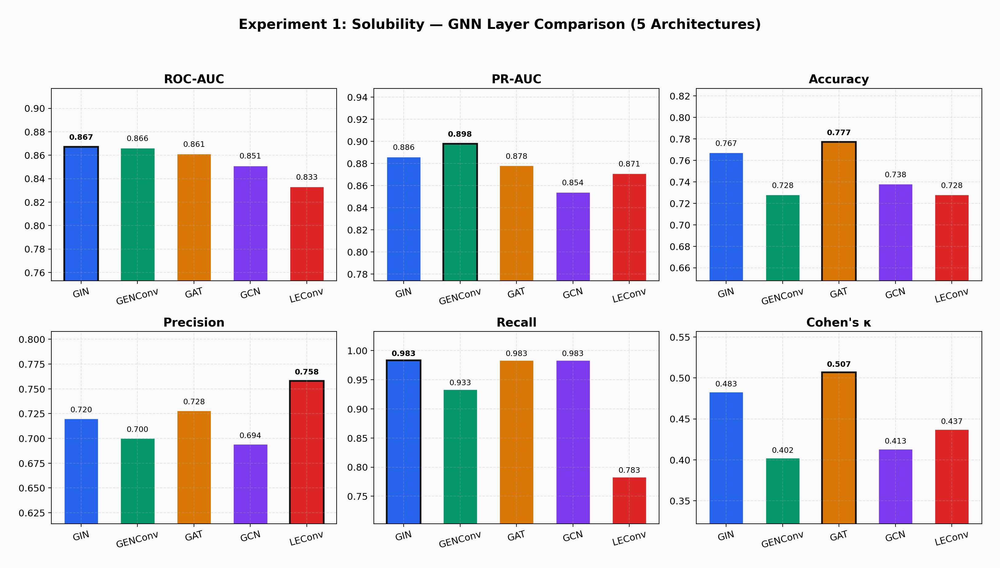
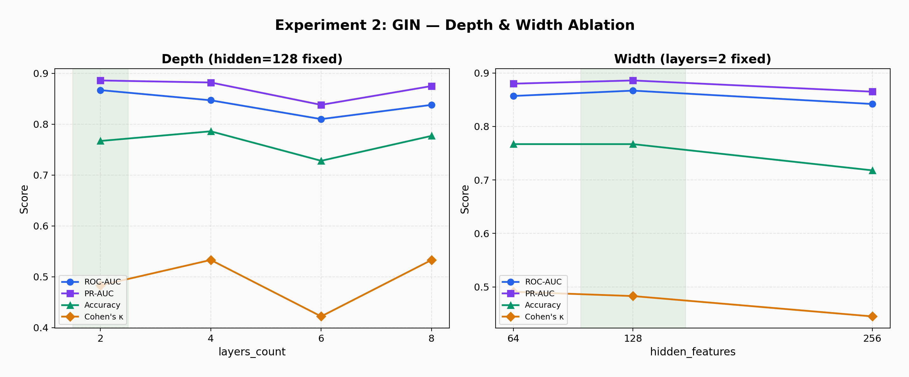
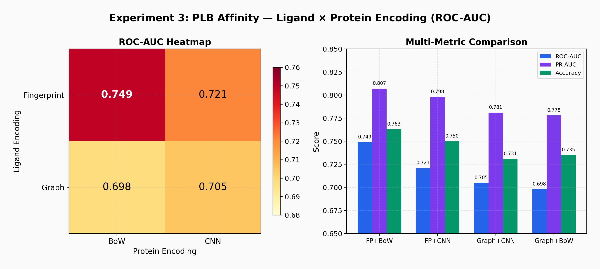
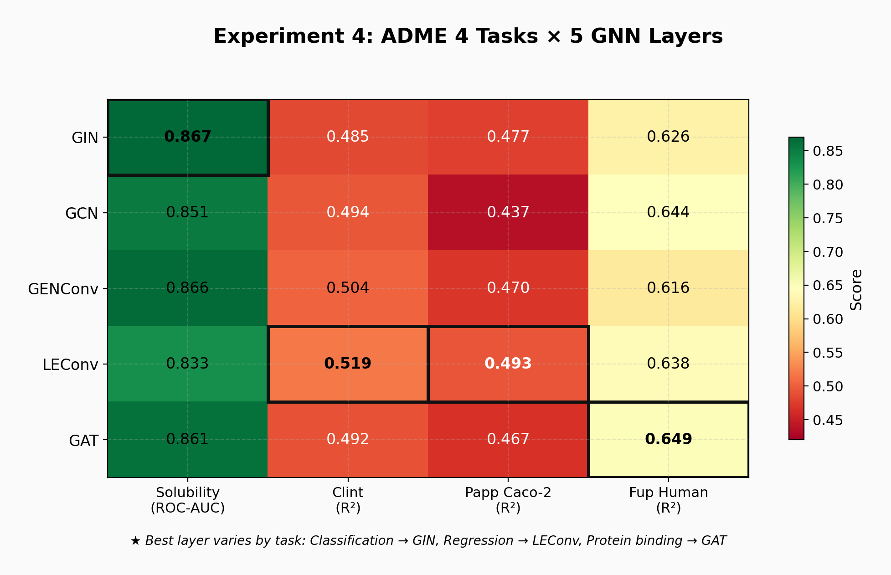

# P1. ADMET Property Prediction with kMoL

**Tool:** [kMoL](https://github.com/elix-tech/kmol) (Elix)  
**Goal:** Determine which GNN architecture best suits each ADMET prediction task  
**Key Finding:** There is no single best GNN layer — the optimal choice depends on the pharmaceutical task

---

## Motivation

ADMET (Absorption, Distribution, Metabolism, Excretion, Toxicity) prediction is the first gate in drug discovery. A candidate with perfect target affinity but poor solubility or high toxicity will fail in clinical trials. kMoL provides a flexible GNN framework for molecular property prediction, but its documentation does not guide users on *which* GNN layer to use for *which* ADMET endpoint.

This project answers that question through systematic ablation across 4 ADMET tasks × 5 GNN architectures.

---

## Experiments

### Experiment 1: Solubility — GNN Layer Comparison

**Setup:** Solubility dataset (514 molecules, binary classification), hidden=128, layers=2, dropout=0.1, epochs=200

| Layer | ROC-AUC | PR-AUC | Accuracy | Precision | Recall | Cohen's κ |
|---|---|---|---|---|---|---|
| **GIN** | **0.867** | 0.886 | 0.767 | 0.720 | 0.983 | 0.483 |
| GENConv | 0.866 | **0.898** | 0.728 | 0.700 | 0.933 | 0.402 |
| GAT | 0.861 | 0.878 | **0.777** | 0.728 | 0.983 | **0.507** |
| GCN | 0.851 | 0.854 | 0.738 | 0.694 | 0.983 | 0.413 |
| LEConv | 0.833 | 0.871 | 0.728 | **0.758** | 0.783 | 0.437 |



**Pharmaceutical Interpretation:**  
GIN's **sum aggregation** excels at solubility prediction because it faithfully counts solubility-determining functional groups (−OH, −NH₂, −COOH). Mean aggregation (GCN) dilutes this count signal, while attention (GAT) focuses on individual atoms rather than total hydrophilic surface. For early-stage **hit finding**, GIN's high recall (0.983) ensures few soluble compounds are missed. For **lead optimization**, LEConv's superior precision (0.758) minimizes false positives.

---

### Experiment 2: GIN Depth & Width

**Setup:** GIN on Solubility, varying depth (layers) and width (hidden features)

**Depth (hidden=128 fixed)**

| Layers | ROC-AUC | PR-AUC | Accuracy | Cohen's κ |
|---|---|---|---|---|
| **2** | **0.867** | 0.886 | 0.767 | 0.483 |
| 4 | 0.847 | 0.882 | 0.786 | 0.533 |
| 6 | 0.810 | 0.838 | 0.728 | 0.422 |
| 8 | 0.838 | 0.875 | 0.777 | 0.533 |

**Width (layers=2 fixed)**

| Hidden | ROC-AUC | PR-AUC | Accuracy | Cohen's κ |
|---|---|---|---|---|
| 64 | 0.857 | 0.880 | 0.767 | 0.491 |
| **128** | **0.867** | 0.886 | 0.767 | 0.483 |
| 256 | 0.842 | 0.865 | 0.718 | 0.445 |



**Pharmaceutical Interpretation:**  
Deeper GNNs suffer **over-smoothing** — as layers stack, local functional group information is averaged away. Solubility is determined by 1–2 hop neighborhood features (hydroxyl groups, amines), so shallow models preserve this critical local information. The 256-hidden model overfits on only 514 samples, confirming that molecular property datasets are typically too small for wide architectures.

---

### Experiment 3: Protein-Ligand Binding — Encoding Comparison

**Setup:** ChEMBL sample (10,000 molecules), 2×2 encoding combinations

| | BoW (Protein) | CNN (Protein) |
|---|---|---|
| **FP (Ligand)** | **0.749** | 0.721 |
| **Graph (Ligand)** | 0.698 | 0.705 |



**Pharmaceutical Interpretation:**  
Morgan fingerprints outperform GNN at this dataset scale (10K) — the explicit enumeration of substructural patterns is more data-efficient than learned representations. BoW outperforming CNN for protein encoding suggests that amino acid composition alone captures sufficient binding-site information at this scale, without requiring sequence-order learning.

---

### Experiment 4: ADME Cross-Comparison (4 Tasks × 5 Layers)

**Setup:** Four ADMET endpoints, each tested with all five GNN layers

| Layer | Solubility (ROC-AUC↑) | Clint (R²↑) | Papp Caco-2 (R²↑) | Fup Human (R²↑) |
|---|---|---|---|---|
| **GIN** | **0.867** | 0.485 | 0.477 | 0.626 |
| GCN | 0.851 | 0.494 | 0.437 | 0.644 |
| GENConv | 0.866 | 0.504 | 0.470 | 0.616 |
| **LEConv** | 0.833 | **0.519** | **0.493** | 0.638 |
| **GAT** | 0.861 | 0.492 | 0.467 | **0.649** |



**Key Finding: The optimal GNN layer differs by task.**

| Task Type | Best Layer | Why (Pharmaceutical) |
|---|---|---|
| Classification (Solubility) | GIN | Sum aggregation counts functional groups that determine soluble/insoluble |
| Regression (Clint, Papp) | LEConv | Extremum-based aggregation captures relative differences between atomic contributions |
| Protein Binding (Fup) | GAT | Attention mechanism identifies hydrophobic regions critical for protein binding |

**Practical Recommendation:** Rather than defaulting to a single GNN architecture, ADMET prediction pipelines should select the layer type based on the endpoint category. This task-specific selection can be automated as a preprocessing step in production pipelines.

---

## Reproduction

```bash
conda activate kmol
cd /path/to/kmol

# Example: Solubility with GIN
kmol train data/configs/model/adme/solubility.json
kmol find_best_checkpoint data/configs/model/adme/solubility.json
kmol eval data/configs/model/adme/solubility.json
```

See `configs/` for all configuration files used.

---

## Limitations

- Solubility dataset is small (514 molecules) — results may shift with larger datasets
- Only five GNN layers tested; newer architectures (e.g., GPS, SAN) may perform differently
- Single random seed for most experiments; variance not fully characterized
- PLB experiment used a 10K sample from ChEMBL; full-scale training may change relative rankings
