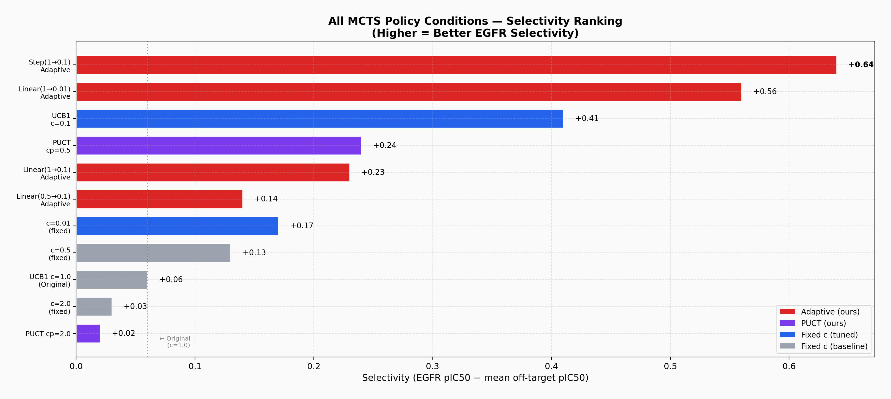
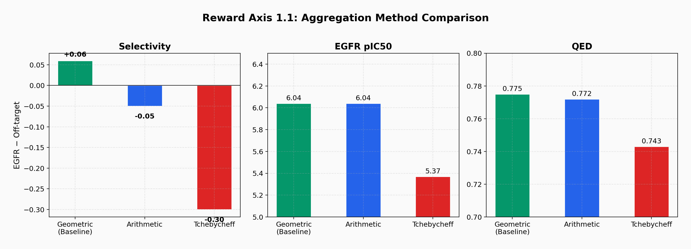
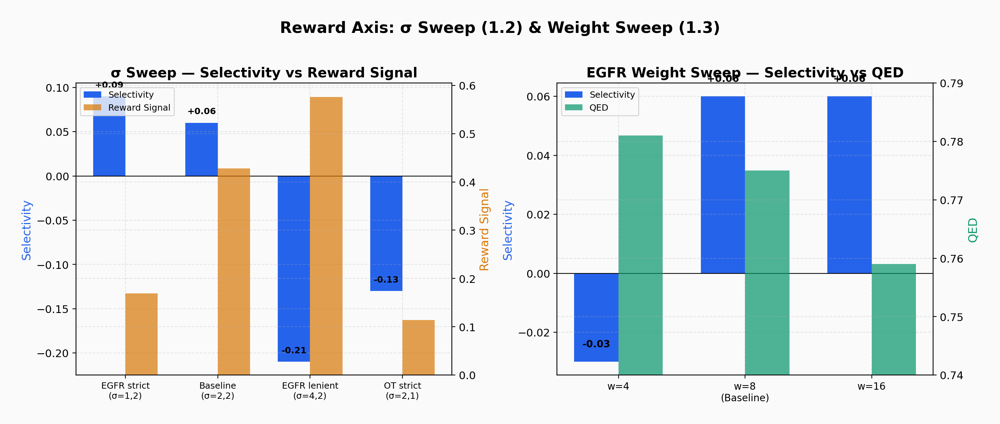
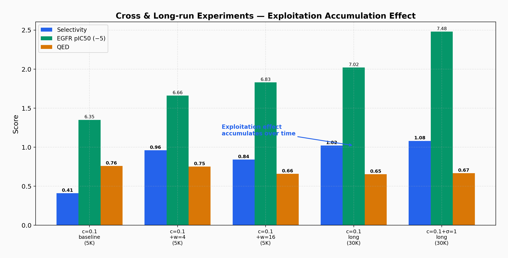
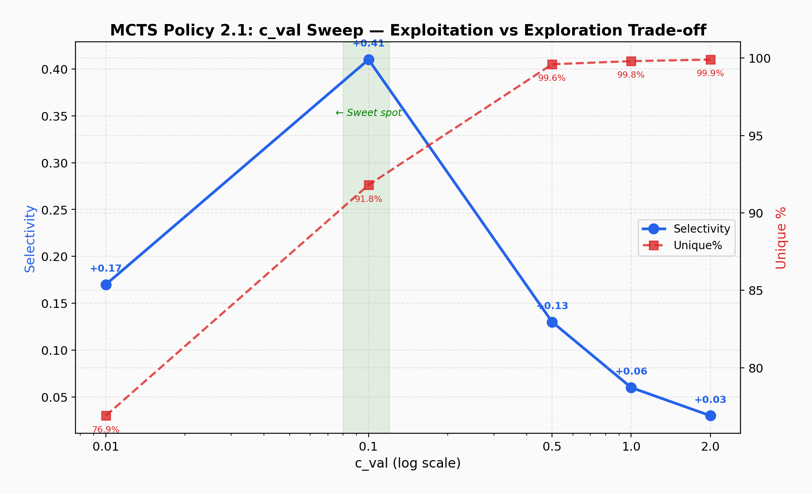
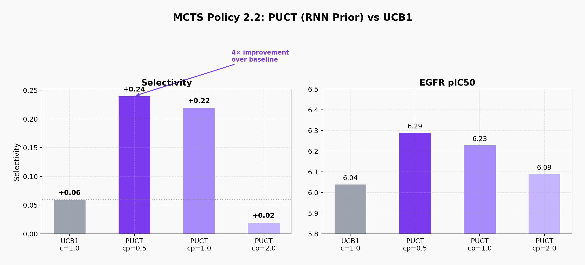
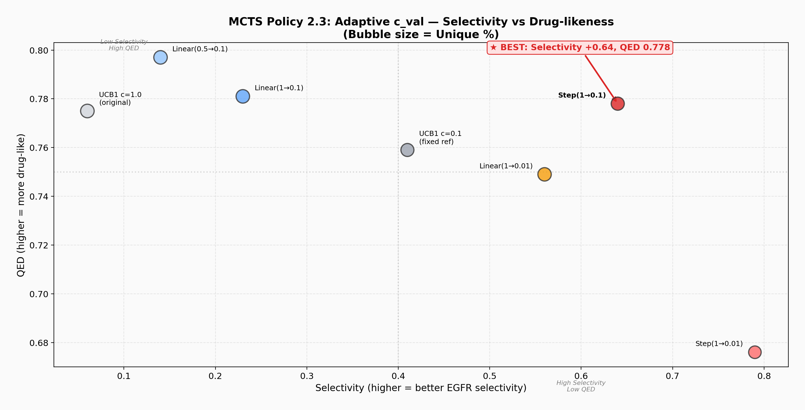
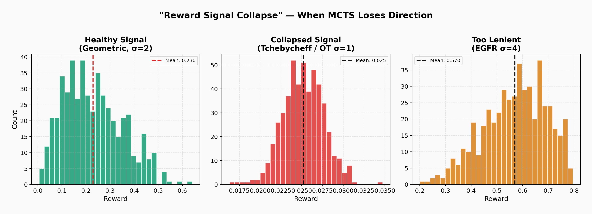

# P2. MCTS-Based Molecular Generation with ChemTSv2

**Tool:** [ChemTSv2](https://github.com/molecule-generator-collection/ChemTSv2) (Elix)  
**Goal:** Design EGFR-selective kinase inhibitors through systematic ablation of reward functions and MCTS policies  
**Key Finding:** Step(1.0→0.1) adaptive scheduling achieves selectivity +0.64 — over 10× the original paper's default. Supplementary fine-search confirms this is the true optimum across 33 tested configurations.

---

## Motivation

ChemTSv2 uses Monte Carlo Tree Search (MCTS) to generate molecules by sequentially selecting SMILES tokens. Two fundamental axes control generation quality: (1) the **reward function** that evaluates generated molecules, and (2) the **MCTS policy** that balances exploration vs. exploitation during search.

The original paper uses fixed defaults (geometric mean reward, UCB1 with c=1.0). This project systematically decomposes both axes to find the optimal combination for a challenging multi-objective task: generating molecules that are selective for EGFR over 8 off-target kinases while maintaining drug-likeness.

---

## Experimental Design

```
ChemTSv2 Ablation Study (33 configurations, 100+ runs)
│
├── Reward Function Axis
│   ├── 1.1  Aggregation method (geometric / arithmetic / Tchebycheff)
│   ├── 1.2  Gaussian σ sweep (9 combinations)
│   ├── 1.3  EGFR weight sweep (w = 4–16, 6 points)
│   ├── Cross experiments (c=0.1 × σ/weight combinations)
│   └── Long-run validation (gen = 30,000)
│
└── MCTS Policy Axis
    ├── 2.1  c_val sweep (0.01 – 2.0, 9 points)
    ├── 2.2  PUCT (RNN prior integration) ← custom implementation
    └── 2.3  Adaptive c_val (12 schedule variants) ← custom implementation
```

**Common conditions:** 18 objectives (9 kinase activities + 4 ADMET + 5 drug-likeness), gen=5,000, 3 seeds (0, 42, 123), ZINC 250K pre-trained RNN.

---

## Results: Complete Ranking (33 Configurations)

### Top 10

| Rank | Configuration | Selectivity | EGFR pIC₅₀ | QED | Unique% | Source |
|---|---|---|---|---|---|---|
| 1 | Step 1.0→0.01 | **+0.79** | 6.84 | 0.676 | 85.7% | Original |
| 2 | **Step 1.0→0.1** | **+0.64** | **6.56** | **0.778** | 93.7% | Original |
| 3 | Linear 1.0→0.01 | +0.56 | 6.51 | 0.749 | 97.4% | Original |
| 4 | **c=0.05** | +0.53 | 6.06 | **0.806** | 83.0% | ★ Supplementary |
| 5 | UCB1 c=0.1 | +0.41 | 6.35 | 0.759 | 91.8% | Original |
| 6 | **Step 0.3→0.1** | +0.38 | 5.89 | 0.741 | 94.1% | ★ Supplementary |
| 7 | **Linear 0.5→0.01** | +0.34 | 5.85 | 0.743 | 93.6% | ★ Supplementary |
| 8 | PUCT cp=0.5 | +0.24 | 6.29 | 0.747 | 95.9% | Original |
| 9 | Linear 1.0→0.1 | +0.23 | 6.20 | 0.781 | 99.0% | Original |
| 10 | UCB1 c=0.01 | +0.17 | 6.25 | 0.673 | 76.9% | Original |

### Remaining 23 Configurations

| Rank | Configuration | Selectivity | EGFR | QED | Unique% | Source |
|---|---|---|---|---|---|---|
| 11 | Linear 0.5→0.1 | +0.14 | 6.14 | 0.797 | 98.6% | Original |
| 12 | Step 1.0→0.05 | +0.14 | 5.76 | 0.713 | 94.9% | ★ Supp |
| 13 | Step 0.3→0.01 | +0.14 | 5.83 | 0.719 | 90.0% | ★ Supp |
| 14 | UCB1 c=0.5 | +0.13 | 6.08 | 0.775 | 99.6% | Original |
| 15 | Linear 0.3→0.01 | +0.13 | 5.69 | 0.735 | 92.3% | ★ Supp |
| 16 | Step 0.5→0.01 | +0.08 | 5.66 | 0.708 | 90.0% | ★ Supp |
| 17 | UCB1 c=1.0 (default) | +0.06 | 6.04 | 0.775 | 99.8% | Original |
| 18 | Linear 0.3→0.1 | +0.05 | 5.59 | 0.756 | 98.5% | ★ Supp |
| 19 | c=0.15 | +0.04 | 5.60 | 0.766 | 98.1% | ★ Supp |
| 20 | UCB1 c=2.0 | +0.03 | 6.03 | 0.764 | 99.9% | Original |
| 21 | c=0.2 | +0.02 | 5.55 | 0.767 | 98.8% | ★ Supp |
| 22 | Step 0.5→0.1 | +0.01 | 5.53 | 0.763 | 94.9% | ★ Supp |
| 23 | Linear 0.5→0.05 | +0.00 | 5.55 | 0.766 | 99.0% | ★ Supp |
| 24 | Linear 1.0→0.05 | −0.03 | 5.52 | 0.755 | 99.3% | ★ Supp |
| 25 | c=0.07 | −0.05 | 5.56 | 0.726 | 90.6% | ★ Supp |
| 26 | σ(4,4) | −0.06 | 5.50 | 0.743 | 99.8% | ★ Supp |
| 27 | σ(3,2) | −0.09 | 5.49 | 0.730 | 99.7% | ★ Supp |
| 28 | w=12 | −0.12 | 5.46 | 0.724 | 99.6% | ★ Supp |
| 29 | w=6 | −0.12 | 5.47 | 0.724 | 99.8% | ★ Supp |
| 30 | w=10 | −0.13 | 5.45 | 0.723 | 99.7% | ★ Supp |
| 31 | σ(1,4) | −0.14 | 5.44 | 0.716 | 99.7% | ★ Supp |
| 32 | σ(4,1) | −0.14 | 5.45 | 0.712 | 99.8% | ★ Supp |
| 33 | σ(1,1) | −0.15 | 5.44 | 0.711 | 99.8% | ★ Supp |



---

## Supplementary Findings

### Finding 1: Step(1.0→0.1) Confirmed as True Optimum

Supplementary experiments tested 12 additional adaptive schedules with varied start values (0.3, 0.5, 1.0), end values (0.01, 0.05, 0.1), and schedule types (linear, step). None surpassed the original Step(1.0→0.1):

- Step 0.5→0.1 (+0.01) — starting too low loses the broad exploration benefit
- Step 1.0→0.05 (+0.14) — ending too low causes over-exploitation
- Step 0.3→0.1 (+0.38) — 6th overall, but still below Step 1.0→0.1

**Conclusion:** The transition from full exploration (c=1.0) to moderate exploitation (c=0.1) at the halfway point is the optimal scheduling strategy. Both the start value (1.0) and end value (0.1) are locally optimal.

### Finding 2: c=0.05 — The QED-Selectivity Trade-off Point

| | c=0.1 | c=0.05 | Difference |
|---|---|---|---|
| Selectivity | +0.41 | +0.53 | +0.12 |
| QED | 0.759 | **0.806** | **+0.047** |
| Unique% | 91.8% | 83.0% | −8.8% |

c=0.05 achieves the highest QED (0.806) across all 33 configurations while maintaining strong selectivity. This represents a **Pareto-optimal trade-off point**: sacrificing modest selectivity for substantially better drug-likeness. In practical drug design, this trade-off is often preferred — a slightly less selective molecule with better ADMET properties may have higher clinical success probability.

### Finding 3: σ and Weight Changes Are c_val-Dependent

All supplementary σ matrix (5 new combinations) and weight fine-search (w=6, 10, 12) experiments produced negative selectivity. However, these were tested at c=1.0 (the default). The original cross-experiments showed that σ and weight interact strongly with c_val — for example, c=0.1 + w=4 achieved +0.96 selectivity. **The σ/weight parameter space should be explored jointly with exploitation level, not independently.**

### Complete σ Matrix

| | OT σ=1 | OT σ=2 | OT σ=4 |
|---|---|---|---|
| **EGFR σ=1** | −0.15 ★ | +0.09 | −0.14 ★ |
| **EGFR σ=2** | −0.13 | +0.06 (baseline) | — |
| **EGFR σ=3** | — | −0.09 ★ | — |
| **EGFR σ=4** | −0.14 ★ | −0.21 | −0.06 ★ |

★ = supplementary result. The baseline (σ=2,2) remains optimal at c=1.0.

### Complete Weight Sweep

| Weight | Selectivity | EGFR | QED |
|---|---|---|---|
| w=4 | −0.03 | 5.86 | 0.781 |
| w=6 ★ | −0.12 | 5.47 | 0.724 |
| w=8 (baseline) | +0.06 | 6.04 | 0.775 |
| w=10 ★ | −0.13 | 5.45 | 0.723 |
| w=12 ★ | −0.12 | 5.46 | 0.724 |
| w=16 | +0.06 | 6.20 | 0.759 |

★ = supplementary result. At c=1.0, w=8 is optimal. Note the non-monotonic pattern: w=4 and w=16 both outperform w=6,10,12, suggesting two distinct regimes.

---

## Reward Function Axis

### 1.1 Aggregation Method

| Method | Selectivity | EGFR | QED | Valid% | Character |
|---|---|---|---|---|---|
| **Geometric** (baseline) | **+0.06** | 6.04 | 0.775 | 58.9% | Non-compensatory: all properties must be satisfied |
| Arithmetic | −0.05 | 6.04 | 0.772 | 100% | Compensatory: high EGFR can mask poor selectivity |
| Tchebycheff | −0.30 | 5.37 | 0.743 | 50.9% | Ultra-conservative: reward signal collapses |



**Pharmaceutical Interpretation:**  
Only the geometric mean achieves positive selectivity. Its non-compensatory nature — if *any* property scores zero, the entire reward is zero — forces the optimizer to suppress off-target activity at the formula level. Tchebycheff produces reward values so low (0.023) that MCTS cannot distinguish promising from unpromising branches.

### 1.2–1.3 Gaussian σ & Weight Sweeps



See Supplementary Findings for complete matrices.

### Cross Experiments & Long-Run Validation

| Condition | Selectivity | EGFR | QED | Generations |
|---|---|---|---|---|
| c=0.1 baseline | +0.41 | 6.35 | 0.759 | 5K |
| c=0.1 + w=4 | **+0.96** | 6.66 | 0.750 | 5K |
| c=0.1 + w=16 | +0.84 | 6.83 | 0.658 | 5K |
| c=0.1 (long-run) | +1.02 | 7.02 | 0.653 | 30K |
| c=0.1 + EGFR σ=1 (long-run) | **+1.08** | 7.48 | 0.666 | 30K |



Exploitation effects accumulate over search length. At 30K generations, selectivity exceeds +1.0.

### Reward Axis Lessons

1. **Aggregation method determines optimization direction** — geometric mean is essential for selectivity
2. **σ controls reward signal strength** — too tight causes signal collapse, too loose removes selection pressure
3. **Weight controls inter-property trade-off** — under exploitation, lower weight is paradoxically better
4. **σ and weight interact with c_val** — optimal values differ between exploration and exploitation regimes (supplementary finding)

---

## MCTS Policy Axis

### 2.1 c_val Sweep (9 Points)

| c_val | Selectivity | EGFR | QED | Unique% | Source |
|---|---|---|---|---|---|
| 0.01 | +0.17 | 6.25 | 0.673 | 76.9% | Original |
| **0.05** | **+0.53** | 6.06 | **0.806** | 83.0% | ★ Supp |
| 0.07 | −0.05 | 5.56 | 0.726 | 90.6% | ★ Supp |
| **0.1** | **+0.41** | **6.35** | 0.759 | 91.8% | Original |
| 0.15 | +0.04 | 5.60 | 0.766 | 98.1% | ★ Supp |
| 0.2 | +0.02 | 5.55 | 0.767 | 98.8% | ★ Supp |
| 0.5 | +0.13 | 6.08 | 0.775 | 99.6% | Original |
| 1.0 (default) | +0.06 | 6.04 | 0.775 | 99.8% | Original |
| 2.0 | +0.03 | 6.03 | 0.764 | 99.9% | Original |



**The selectivity-c_val relationship is non-monotonic.** Peak selectivity occurs at c=0.05 (+0.53), drops sharply at c=0.07 (−0.05), then recovers at c=0.1 (+0.41). This suggests two distinct exploitation regimes: c=0.05 optimizes for drug-likeness (QED=0.806), while c=0.1 optimizes for target activity (EGFR=6.35). The instability at c=0.07 indicates a phase transition boundary between these regimes.

### 2.2 PUCT — RNN Prior Integration (Custom Implementation)

**Implementation:** New file `policy/puct.py` + patches to `mcts.py` and `utils.py`

```
PUCT = Q(s,a)/N(s,a) + c_puct × P(s,a) × √N(s) / (1 + N(s,a))
```

where P(s,a) is the RNN's predicted probability for token *a* at state *s*.

| Policy | Selectivity | EGFR | QED | Unique% |
|---|---|---|---|---|
| UCB1 c=1.0 | +0.06 | 6.04 | 0.775 | 99.8% |
| **PUCT cp=0.5** | **+0.24** | **6.29** | 0.747 | 95.9% |
| PUCT cp=1.0 | +0.22 | 6.23 | 0.765 | 99.7% |
| PUCT cp=2.0 | +0.02 | 6.09 | 0.761 | 100% |



**Pharmaceutical Interpretation:**  
PUCT (cp=0.5) achieves 4× the selectivity of UCB1 at the same exploration level. The RNN prior steers search toward chemically plausible token sequences, avoiding wasted rollouts on syntactically invalid or pharmacologically irrelevant molecules.

### 2.3 Adaptive c_val — Dynamic Scheduling (Custom Implementation, 12 Variants)

**Implementation:** New file `policy/adaptive_ucb1.py` + patch to `mcts.py`

| Policy | Selectivity | EGFR | QED | Unique% | Source |
|---|---|---|---|---|---|
| **Step 1.0→0.01** | **+0.79** | **6.84** | 0.676 | 85.7% | Original |
| **Step 1.0→0.1** | **+0.64** | **6.56** | **0.778** | 93.7% | Original |
| Linear 1.0→0.01 | +0.56 | 6.51 | 0.749 | 97.4% | Original |
| Step 0.3→0.1 | +0.38 | 5.89 | 0.741 | 94.1% | ★ Supp |
| Linear 0.5→0.01 | +0.34 | 5.85 | 0.743 | 93.6% | ★ Supp |
| Linear 1.0→0.1 | +0.23 | 6.20 | 0.781 | 99.0% | Original |
| Step 1.0→0.05 | +0.14 | 5.76 | 0.713 | 94.9% | ★ Supp |
| Step 0.3→0.01 | +0.14 | 5.83 | 0.719 | 90.0% | ★ Supp |
| Linear 0.5→0.1 | +0.14 | 6.14 | 0.797 | 98.6% | Original |
| Linear 0.3→0.01 | +0.13 | 5.69 | 0.735 | 92.3% | ★ Supp |
| Step 0.5→0.01 | +0.08 | 5.66 | 0.708 | 90.0% | ★ Supp |
| Linear 0.3→0.1 | +0.05 | 5.59 | 0.756 | 98.5% | ★ Supp |
| Linear 0.5→0.05 | +0.00 | 5.55 | 0.766 | 99.0% | ★ Supp |
| Linear 1.0→0.05 | −0.03 | 5.52 | 0.755 | 99.3% | ★ Supp |
| Step 0.5→0.1 | +0.01 | 5.53 | 0.763 | 94.9% | ★ Supp |



**Step(1.0→0.1) is confirmed as the overall best balanced configuration** across all 12 variants tested. The pattern is clear: starting from c=1.0 (full exploration) is critical — schedules starting at 0.3 or 0.5 consistently underperform. End values of 0.05 or lower cause over-exploitation, degrading both selectivity and QED.

**Best configuration (balanced):** Step 1.0→0.1 (Sel +0.64, QED 0.778, Unique 93.7%)  
**Best configuration (raw selectivity):** Step 1.0→0.01 (Sel +0.79, but QED drops to 0.676)

---

## Key Discovery: Reward Signal Collapse



Observed independently in three experiments (Tchebycheff aggregation, off-target σ=1, EGFR σ=1) and confirmed by 5 additional σ matrix combinations in supplementary experiments:

> **When reward signal is too weak or uniform, MCTS loses its ability to discriminate between promising and unpromising branches.**

MCTS selects branches based on Q(s,a)/N(s,a) differences in the UCB formula. When most molecules receive similarly low rewards, these differences vanish, and tree search degrades to random sampling. This is a fundamental constraint of MCTS-based molecular generation — distinct from mode collapse in VAEs or training instability in GANs.

**Connection to P3:** This same failure mode reappears when prediction models are inaccurate (P4: kMoL with R²=0.087), confirming that reward signal quality is the critical bottleneck across the entire pipeline.

---

## Custom Code

All custom implementations are included in this repository:

| File | Description |
|---|---|
| [`policy/puct.py`](policy/puct.py) | PUCT policy with RNN prior integration |
| [`policy/adaptive_ucb1.py`](policy/adaptive_ucb1.py) | Adaptive UCB1 with linear and step decay |
| [`reward/dscore_reward_ablation.py`](reward/dscore_reward_ablation.py) | Aggregation method branching |
| [`patches/`](patches/) | Diffs for mcts.py and utils.py modifications |

---

## Reproduction

```bash
conda activate elix
cd /path/to/ChemTSv2

# Baseline (geometric mean, c=1.0)
chemtsv2 -c config/setting_dscore.yaml

# Step adaptive (best configuration)
# Requires adaptive_ucb1.py + mcts.py patch
chemtsv2 -c config/setting_dscore_step.yaml

# Supplementary experiments
python generate_configs.py  # generates config/p2s_*.yaml
bash run_p2s_tier1.sh       # c_val fine + adaptive
bash run_p2s_tier2.sh       # σ matrix + weight
bash run_p2s_tier3.sh       # adaptive extras
python collect_results.py --compare-existing
```

See `configs/` for all experiment configurations.

---

## Limitations

- EGFR activity predictions use LightGBM surrogate models, not experimental assays
- 3 random seeds provide limited variance estimation for original experiments; supplementary experiments use 1 seed (screening)
- ZINC 250K pre-trained RNN may bias toward certain chemical scaffolds
- Selectivity metric is computed from predicted pIC₅₀ values, not measured Ki ratios
- σ/weight supplementary experiments were run at c=1.0 only; joint optimization with c=0.1 may yield different results
- Non-monotonic behavior at c=0.07 warrants investigation with additional seeds
