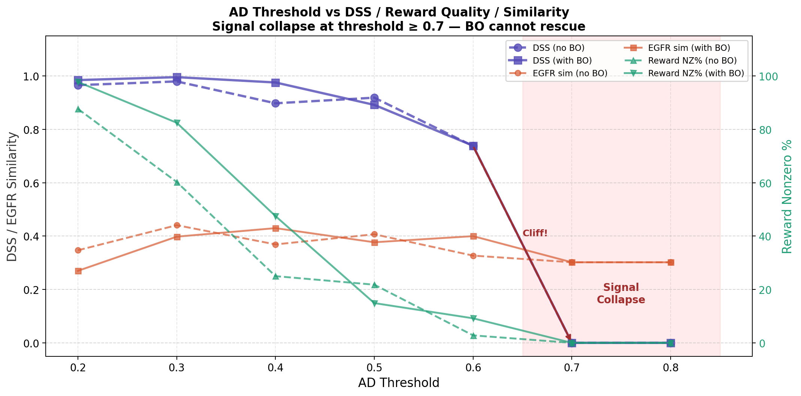
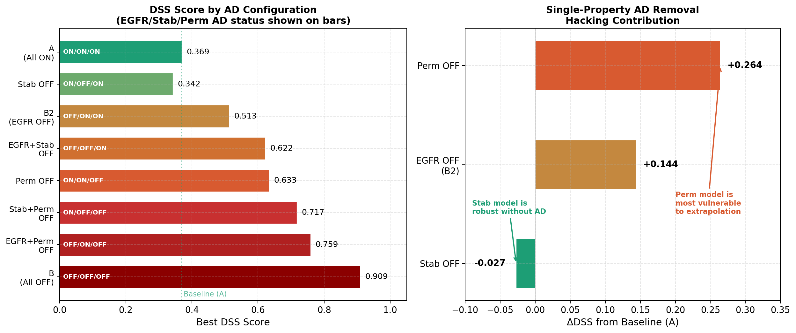
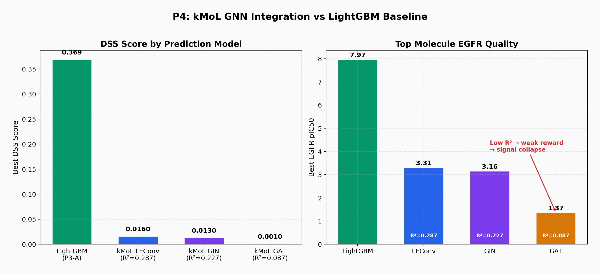
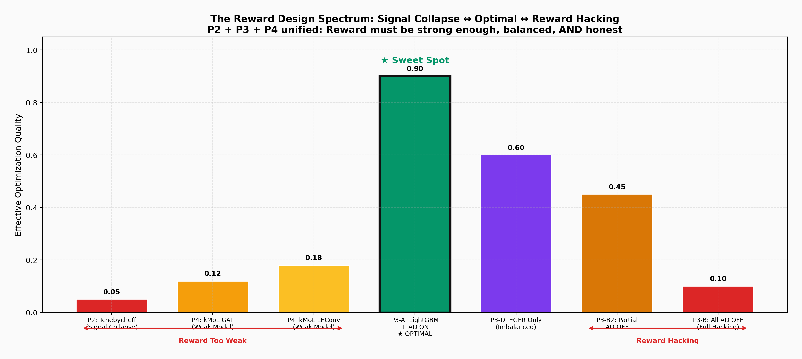

# P3+P4. Multi-Objective Optimization & Integrated Pipeline

**Tools:** [DyRAMO](https://github.com/molecule-generator-collection/DyRAMO) + [kMoL](https://github.com/elix-tech/kmol) + [ChemTSv2](https://github.com/molecule-generator-collection/ChemTSv2) (Elix)  
**Goal:** Investigate AD's role in preventing reward hacking, and validate that prediction model accuracy propagates through the generation pipeline  
**Key Finding:** AD threshold has a sharp cliff at 0.7; Permeability AD is the most critical safeguard; and prediction model R² directly determines generated molecule quality

---

## Motivation

DyRAMO automates multi-objective molecular optimization by using Bayesian Optimization (BO) to search over "reliability levels" — thresholds that determine how strictly the Applicability Domain (AD) constraint is enforced. AD ensures that generated molecules remain within the prediction model's training domain, preventing the optimizer from exploiting extrapolation regions where predictions are unreliable.

**The central question:** What happens when we remove this safety net?

This connects directly to P2's discovery of **reward signal collapse** — together, they define the two failure modes of the **Reward Design Spectrum**.

---

## 1. AD Ablation Study (5 Experiments)

### Experimental Design

Five experiments comparing AD configurations on EGFR + metabolic stability + permeability optimization:

| Exp | Description | AD Status | BO |
|---|---|---|---|
| A | All AD ON (baseline) | Full AD | BO 40 iters |
| B | All AD OFF | No AD | BO 40 iters |
| B2 | EGFR AD only OFF | Partial | BO 40 iters |
| C | Fixed threshold (no BO) | Full AD | None (0.5/0.5/0.5) |
| D | EGFR only (single objective) | Full AD | BO 40 iters |

### DSS Score Comparison

| Exp | Description | Best DSS | EGFR Level | Stab Level | Perm Level |
|---|---|---|---|---|---|
| A | AD ON (baseline) | 0.369 | 0.62 | 0.46 | 0.34 |
| **B** | **AD OFF** | **0.907** | **0.90** | **0.84** | **0.89** |
| B2 | EGFR AD OFF | 0.493 | 0.90 | 0.46 | 0.45 |
| C | Fixed threshold | 0.919 | 0.50 | 0.50 | 0.50 |
| D | EGFR only | 0.458 | 0.71 | 0.43 | 0.43 |


### Reward Hacking in Action

The DSS jump from 0.369 (A) to 0.907 (B) is not a real improvement — it is **reward hacking**. Without AD, BO discovers that the prediction models extrapolate wildly outside their training domain, producing unrealistically high activity predictions.

Evidence from top molecules:

**Experiment A (AD ON) — Top 5:**

| EGFR pIC₅₀ | Tanimoto | Reward | Stab |
|---|---|---|---|
| 7.97 | 0.661 | 0.957 | 76.1 |
| 7.94 | 1.000 | 0.954 | 73.8 |
| 7.94 | 1.000 | 0.954 | 73.8 |
| 7.92 | 0.722 | 0.950 | 75.4 |
| 7.87 | 0.829 | 0.878 | 43.5 |

**Experiment B (AD OFF) — Top 5:**

| EGFR pIC₅₀ | Tanimoto | Reward | Stab |
|---|---|---|---|
| 7.48 | 0.217 | 0.885 | 87.4 |
| 7.39 | 0.212 | 0.876 | 76.2 |
| 7.51 | 0.509 | 0.872 | 64.7 |
| 7.41 | 0.228 | 0.868 | 73.0 |
| 7.35 | 0.246 | 0.864 | 78.8 |


**Critical observation:** AD-OFF molecules have very low Tanimoto similarity to training data (0.21–0.25 vs 0.66–1.00 for AD-ON). These molecules are structurally distant from anything the model was trained on — predictions in this region are unreliable.


### Single vs Multi-Objective

| | EGFR pIC₅₀ (Top) | Stab (Top) | Balanced? |
|---|---|---|---|
| D (EGFR only) | 7.98 | 29.2 | No — metabolic stability collapses |
| A (Multi-objective) | 7.97 | 76.1 | Yes — balanced across all properties |


**Pharmaceutical Interpretation:**  
A drug candidate with EGFR pIC₅₀ = 7.98 but metabolic stability = 29.2% would be cleared too rapidly in vivo, requiring impractical dosing frequency. Multi-objective optimization sacrifices negligible EGFR activity (7.97 vs 7.98) to gain substantial metabolic stability (76.1%). This is exactly the trade-off medicinal chemists make daily.

---

## 2. AD Threshold Sweep — The Cliff (14 Experiments)

### Motivation

Experiments A (full AD) and B (no AD) define two extremes, but the transition between them is unknown. Where exactly does reward hacking begin? Is there an optimal threshold? Can BO compensate for a strict threshold?

### Experimental Design

AD threshold was swept from 0.2 to 0.8, with all three properties set to the same threshold. Each threshold was tested both without BO (single fixed evaluation) and with BO (8 iterations over ±0.01 range).

| Threshold | No BO | With BO |
|---|---|---|
| 0.2 | T1 th=0.2 | T1 fixed=0.2 (BO) |
| 0.3 | T1 th=0.3 | T1 fixed=0.3 (BO) |
| 0.4 | T1 th=0.4 | T1 fixed=0.4 (BO) |
| 0.5 | C (existing) | T1 fixed=0.5 (BO) |
| 0.6 | T1 th=0.6 | T1 fixed=0.6 (BO) |
| 0.7 | T1 th=0.7 | T1 fixed=0.7 (BO) |
| 0.8 | T1 th=0.8 | T1 fixed=0.8 (BO) |

### Results: The 0.7 Cliff

| Threshold | DSS (no BO) | DSS (BO) | Reward NZ% (no BO) | Reward NZ% (BO) | EGFR sim |
|---|---|---|---|---|---|
| 0.2 | 0.966 | 0.985 | 87.7% | 97.8% | 0.347 |
| 0.3 | 0.980 | **0.996** | 60.3% | 82.5% | 0.441 |
| 0.4 | 0.898 | 0.976 | 25.0% | 47.5% | 0.369 |
| 0.5 | 0.919 | 0.892 | 21.8% | 14.9% | 0.407 |
| 0.6 | 0.738 | 0.739 | 2.8% | 9.2% | 0.327 |
| **0.7** | **0.000** | **0.000** | **0.0%** | **0.0%** | 0.302 |
| **0.8** | **0.000** | **0.000** | **0.0%** | **0.0%** | 0.302 |



### Key Findings

**1. Signal collapse cliff at threshold ≥ 0.7.** When AD requires Tanimoto similarity ≥ 0.7 to training data, zero molecules pass the filter. Reward becomes uniformly zero, and MCTS degenerates into random search. This is a structural limit — no amount of BO can rescue it.

**2. BO cannot shift the cliff.** With BO at threshold 0.7 and 0.8, all 8 action combinations were explored — every single one produced DSS = 0. The cliff is determined by the AD filter's interaction with the chemical space, not by the optimizer.

**3. Low thresholds ≈ AD OFF.** At threshold 0.2, DSS = 0.966 with EGFR similarity = 0.347 — nearly identical to experiment B (AD OFF, DSS = 0.909, similarity = 0.284). Low thresholds provide the illusion of AD enforcement while permitting out-of-domain molecules.

**4. The transition zone (0.4–0.6) is where reward quality degrades.** Reward nonzero% drops from 25% at threshold 0.4 to 2.8% at 0.6 — the reward signal weakens progressively before collapsing entirely.

**Pharmaceutical Interpretation:**  
The cliff at 0.7 reflects a fundamental property of chemical space: most generated molecules have Tanimoto similarity < 0.7 to training data. This is not a flaw in DyRAMO — it reveals that the EGFR prediction model's training set covers only a narrow region of drug-like space. Expanding training data coverage would push the cliff higher.

---

## 3. Property-Specific AD Matrix (5 Experiments)

### Motivation

Experiments A and B treat AD as a single on/off switch, but AD applies independently to each property (EGFR, metabolic stability, permeability). Which property's AD is most critical for preventing reward hacking?

### Experimental Design

Systematic ablation of AD by property, with BO (40 iterations) for all experiments:

| Exp | EGFR AD | Stab AD | Perm AD |
|---|---|---|---|
| A (baseline) | ON | ON | ON |
| T2 Stab OFF | ON | **OFF** | ON |
| T2 Perm OFF | ON | ON | **OFF** |
| B2 (EGFR OFF) | **OFF** | ON | ON |
| T2 Stab+Perm OFF | ON | **OFF** | **OFF** |
| T2 EGFR+Stab OFF | **OFF** | **OFF** | ON |
| T2 EGFR+Perm OFF | **OFF** | ON | **OFF** |
| B (all OFF) | **OFF** | **OFF** | **OFF** |

### Results

| Exp | EGFR AD | Stab AD | Perm AD | Best DSS | EGFR sim | Reward NZ% |
|---|---|---|---|---|---|---|
| A (baseline) | ON | ON | ON | 0.369 | 0.545 | 50.3% |
| T2 Stab OFF | ON | OFF | ON | 0.342 | 0.435 | 23.2% |
| T2 Perm OFF | ON | ON | OFF | 0.633 | 0.572 | 55.4% |
| B2 (EGFR OFF) | OFF | ON | ON | 0.513 | 0.321 | 35.2% |
| T2 Stab+Perm OFF | ON | OFF | OFF | 0.717 | 0.563 | 63.0% |
| T2 EGFR+Stab OFF | OFF | OFF | ON | 0.622 | 0.292 | 16.6% |
| T2 EGFR+Perm OFF | OFF | ON | OFF | 0.759 | 0.572 | 70.6% |
| B (all OFF) | OFF | OFF | OFF | 0.909 | 0.284 | 98.0% |



### DSS Increase from Baseline (Hacking Contribution)

Removing each property's AD increases DSS by different amounts relative to baseline A (0.369):

| AD Removed | ΔDSS | Interpretation |
|---|---|---|
| Perm OFF | +0.264 | **Most vulnerable** — Perm model extrapolates aggressively |
| EGFR OFF (B2) | +0.144 | Moderate vulnerability |
| Stab OFF | −0.027 | **Negligible** — Stab model is robust without AD |
| Stab+Perm OFF | +0.348 | Additive effect |
| EGFR+Perm OFF | +0.390 | Strongest 2-property hacking |
| All OFF (B) | +0.540 | Maximum hacking |

### Key Findings

**1. Permeability AD is the most critical safeguard.** Removing Perm AD alone causes the largest DSS jump (+0.264). The permeability prediction model is most prone to extrapolation — it produces unrealistically high predictions for out-of-domain molecules.

**2. Stability AD is nearly irrelevant.** Removing Stab AD actually decreases DSS slightly (0.342 vs 0.369). The metabolic stability model produces conservative predictions even outside its training domain, making AD unnecessary for this property.

**3. Perm OFF preserves in-domain quality.** Surprisingly, EGFR similarity increases from 0.545 to 0.572 when Perm AD is removed — BO exploits the Perm model's extrapolation while staying within EGFR's training domain. This is a subtle form of partial hacking.

**Pharmaceutical Interpretation:**  
Membrane permeability (Caco-2, PAMPA) is notoriously difficult to predict because it depends on multiple interacting factors: lipophilicity, molecular flexibility, hydrogen bonding, and active transport. Small structural changes can drastically alter permeability in ways that linear models struggle to capture. This explains why the permeability model is most vulnerable to extrapolation — its structure-activity relationship is inherently nonlinear and discontinuous. In contrast, metabolic stability has a smoother relationship with molecular descriptors, making predictions more conservative even outside the training domain.

---

## 4. Integrated Pipeline — kMoL → DyRAMO (3 Experiments)

### Motivation

P1 trained kMoL GNN models for ADMET prediction. P2 discovered that weak reward signals cause MCTS to degrade to random search. P3 showed that DyRAMO with LightGBM + AD produces realistic candidates (DSS = 0.369).

**The question:** What happens when we swap LightGBM (R² ≈ 0.7+) for kMoL GNN models (R² = 0.08–0.29)?

This experiment connects all three Elix tools into a single pipeline and tests the weakest link hypothesis: the entire pipeline is only as good as its least accurate component.

### Pipeline Architecture

```
kMoL (P1)                    ChemTSv2 (P2)              DyRAMO (P3)
┌─────────────┐    reward    ┌──────────────┐   BO      ┌───────────┐
│ GNN Model   │───signal───► │ MCTS Search  │◄─────────►│ Bayesian  │
│ (LEConv/    │              │ (molecule    │  optimize  │ Optimizer │
│  GIN/GAT)   │              │  generation) │  AD levels │           │
└─────────────┘              └──────────────┘            └───────────┘
     R²=0.08~0.29                                        
     vs LightGBM R²≈0.7+                                 
```

### Results

| Model | R² (est.) | Best DSS | Top EGFR pIC₅₀ | Top Reward |
|---|---|---|---|---|
| **LightGBM (P3-A)** | **~0.7+** | **0.369** | **7.97** | **0.957** |
| kMoL LEConv | 0.287 | 0.016 | 3.31 | 0.026 |
| kMoL GIN | 0.227 | 0.013 | 3.16 | 0.026 |
| kMoL GAT | 0.087 | 0.001 | 1.37 | 0.021 |



The gap is dramatic: LightGBM achieves DSS 0.369 while the best kMoL model (LEConv) achieves only 0.016 — a 23× difference. Top EGFR pIC₅₀ drops from 7.97 to 3.31, meaning generated molecules are predicted to be ~4,500× less potent. Even within kMoL models, the ranking is monotonic: LEConv (R²=0.287) > GIN (R²=0.227) > GAT (R²=0.087), confirming prediction accuracy as the bottleneck.

### Signal Collapse Reconfirmed

This is the same reward signal collapse discovered in P2, now at the pipeline level. P2's Tchebycheff aggregation produced reward ≈ 0.023; P4's kMoL GAT produces reward ≈ 0.021. The mechanism is identical: when Q(s,a)/N(s,a) values in the UCB formula are uniformly low, the exploration term dominates and MCTS degenerates into random sampling.

### Why kMoL Underperforms LightGBM

This is not a GNN-vs-gradient-boosting comparison. The performance gap comes from training data:

| Factor | kMoL | LightGBM |
|---|---|---|
| Training data | Elix ADMET datasets (hundreds–thousands) | Task-specific kinase datasets (tens of thousands) |
| Features | Learned GNN embeddings | Morgan fingerprints (2048-bit) |
| Task match | General ADMET → applied to EGFR | Trained directly on EGFR-related data |

The lesson is about data appropriateness, not model architecture. With equivalent training data, GNN models can match or exceed fingerprint-based models.

---

## Summary: Four Layers of Understanding

| Layer | Experiment | Finding |
|---|---|---|
| **Binary** | A vs B (Sec. 1) | AD ON prevents reward hacking (DSS 0.369 vs 0.907) |
| **Continuous** | Threshold sweep (Sec. 2) | Sharp cliff at 0.7 — signal collapse is structural |
| **Per-property** | AD matrix (Sec. 3) | Permeability AD is most critical; stability AD is negligible |
| **Model quality** | kMoL integration (Sec. 4) | R² directly determines DSS — reward signal collapse reconfirmed |

Together with P2's reward signal collapse, this defines the complete **Reward Design Spectrum**:

```
Signal Collapse                  Optimal                    Reward Hacking
(th ≥ 0.7 | kMoL R²<0.3)       (A: LightGBM + AD ON)      (B: AD OFF)
←────────────────────────── Reward Design Spectrum ──────────────────────────→
reward too weak/inaccurate       balanced & honest           reward inflated
```



---

## Reproduction

```bash
conda activate elix
cd /path/to/DyRAMO

# Experiment A: AD ON (baseline)
python run.py -c config/setting_dyramo.yaml

# Experiment B: AD OFF
python run.py -c config/setting_dyramo_ad_off.yaml

# Tier 1: AD threshold sweep (example: threshold=0.3)
python run.py -c config/p3s_t1_ad_0.3.yaml           # no BO
python run.py -c config/p3s_t1_ad_fixed_0.3.yaml      # with BO

# Tier 2: Property-specific AD OFF (example: Perm OFF)
python run.py -c config/p3s_t2_perm_off.yaml

# P4: kMoL integration (requires kMoL model from P1)
conda activate kmol
cd /path/to/kmol
kmol train data/configs/model/adme/solubility.json     # train kMoL model first

conda activate elix
cd /path/to/DyRAMO
python run.py -c config/setting_dyramo_kmol_le.yaml    # LEConv
python run.py -c config/setting_dyramo_kmol_gin.yaml   # GIN
python run.py -c config/setting_dyramo_kmol_gat.yaml   # GAT
```

**Note:** Each DyRAMO run invokes ChemTSv2 as a subprocess. With generation_num=10,000 and 40 BO iterations, a single experiment takes ~7 hours. For testing, reduce generation_num to 1,000 and BO iterations to 15.

See `configs/` for all experiment configurations (27 total: 5 original + 14 threshold sweep + 5 AD matrix + 3 kMoL integration).

---

## Limitations

- DyRAMO experiments used default ChemTSv2 settings (c=0.01), not the optimal Step adaptive policy from P2
- Only 3 properties (EGFR, metabolic stability, permeability) tested in multi-objective setting
- Tier 1 threshold sweep uses uniform threshold across all properties — asymmetric thresholds not explored
- Tier 2 experiments used single seed — results may vary across random seeds
- DSS priority variations (all-low, EGFR-high, stability-high) not yet explored
- kMoL models trained on small ADMET datasets — comparison with LightGBM is confounded by data scale
- Only EGFR prediction was swapped to kMoL; metabolic stability and permeability still used LightGBM

