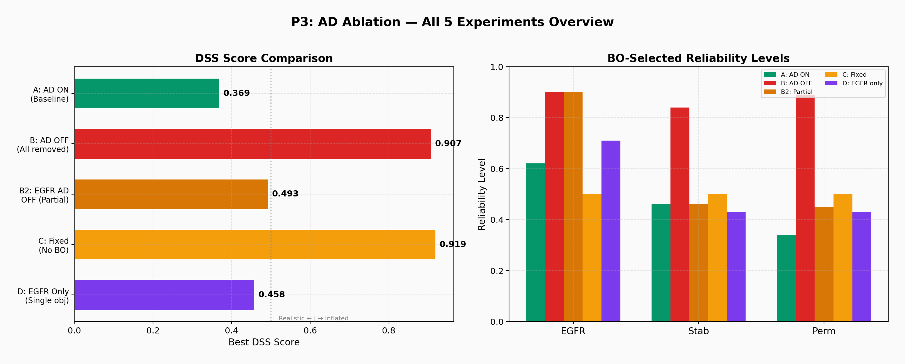
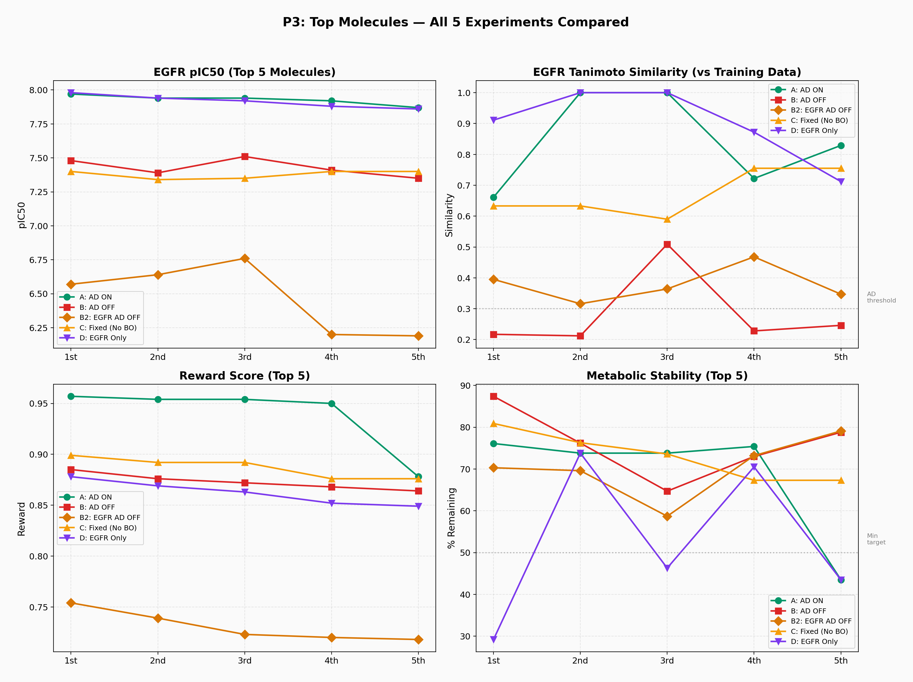
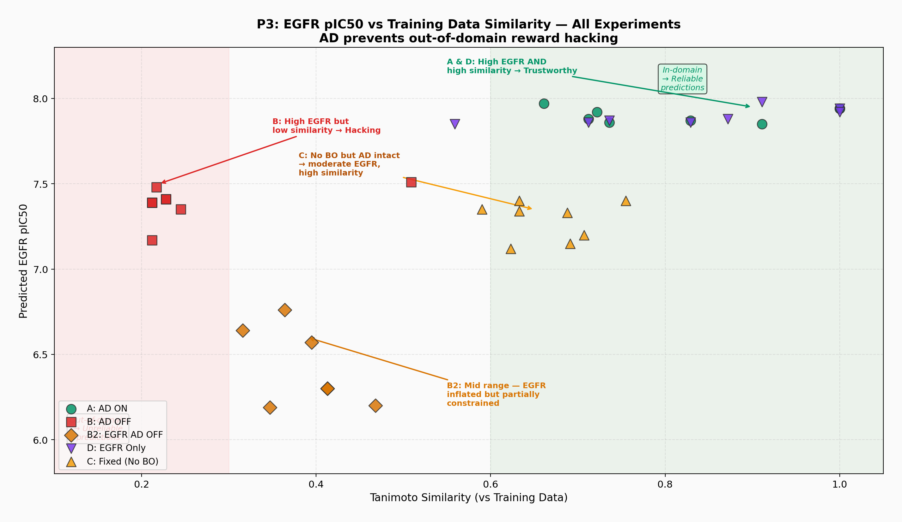
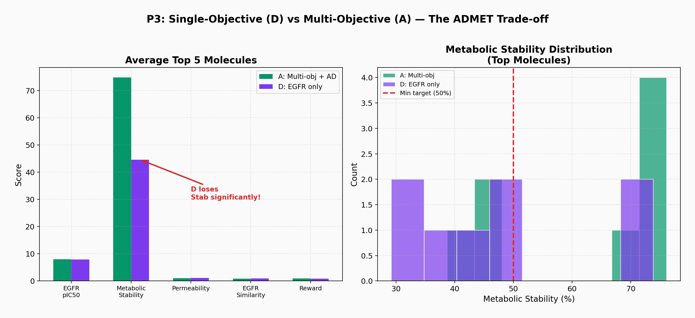

# P3. Multi-Objective Optimization with DyRAMO

**Tool:** [DyRAMO](https://github.com/molecule-generator-collection/DyRAMO) (Elix)  
**Goal:** Investigate the role of Applicability Domain (AD) in preventing reward hacking  
**Key Finding:** Removing AD inflates DSS from 0.369 to 0.907 — a textbook case of reward hacking

---

## Motivation

DyRAMO automates multi-objective molecular optimization by using Bayesian Optimization (BO) to search over "reliability levels" — thresholds that determine how strictly the Applicability Domain (AD) constraint is enforced. AD ensures that generated molecules remain within the prediction model's training domain, preventing the optimizer from exploiting extrapolation regions where predictions are unreliable.

**The central question:** What happens when we remove this safety net?

This connects directly to P2's discovery of **reward signal collapse** — together, they define the two failure modes of the **Reward Design Spectrum**.

---

## AD Ablation Study

### Experimental Design

Five experiments comparing AD configurations on EGFR + metabolic stability + permeability optimization:

| Exp | Description | AD Status | BO |
|---|---|---|---|
| A | All AD ON (baseline) | Full AD | BO search |
| B | All AD OFF | No AD | BO search |
| B2 | EGFR AD only OFF | Partial | BO search |
| C | Fixed threshold (no BO) | Full AD | None (0.5/0.5/0.5) |
| D | EGFR only (single objective) | Full AD | BO search |

### DSS Score Comparison

| Exp | Description | Best DSS | EGFR Level | Stab Level | Perm Level |
|---|---|---|---|---|---|
| A | AD ON (baseline) | 0.369 | 0.62 | 0.46 | 0.34 |
| **B** | **AD OFF** | **0.907** | **0.90** | **0.84** | **0.89** |
| B2 | EGFR AD OFF | 0.493 | 0.90 | 0.46 | 0.45 |
| C | Fixed threshold | 0.919 | 0.50 | 0.50 | 0.50 |
| D | EGFR only | 0.458 | 0.71 | 0.43 | 0.43 |



### Reward Hacking in Action

The DSS jump from 0.369 (A) to 0.907 (B) is not a real improvement — it is **reward hacking**. Without AD, BO discovers that the prediction models extrapolate wildly outside their training domain, producing unrealistically high activity predictions.

Evidence from top molecules:

**Experiment A (AD ON) — Top 5:**

| EGFR pIC₅₀ | Tanimoto | Reward | Stab |
|---|---|---|---|
| 7.97 | 0.661 | 0.957 | 76.1 |
| 7.94 | 1.000 | 0.954 | 73.8 |
| 7.94 | 1.000 | 0.954 | 73.8 |
| 7.92 | 0.722 | 0.950 | 75.4 |
| 7.87 | 0.829 | 0.878 | 43.5 |

**Experiment B (AD OFF) — Top 5:**

| EGFR pIC₅₀ | Tanimoto | Reward | Stab |
|---|---|---|---|
| 7.48 | 0.217 | 0.885 | 87.4 |
| 7.39 | 0.212 | 0.876 | 76.2 |
| 7.51 | 0.509 | 0.872 | 64.7 |
| 7.41 | 0.228 | 0.868 | 73.0 |
| 7.35 | 0.246 | 0.864 | 78.8 |



**Critical observation:** AD-OFF molecules have very low Tanimoto similarity to training data (0.21–0.25 vs 0.66–1.00 for AD-ON). These molecules are structurally distant from anything the model was trained on — predictions in this region are unreliable.



### Single vs Multi-Objective

| | EGFR pIC₅₀ (Top) | Stab (Top) | Balanced? |
|---|---|---|---|
| D (EGFR only) | 7.98 | 29.2 | No — metabolic stability collapses |
| A (Multi-objective) | 7.97 | 76.1 | Yes — balanced across all properties |



**Pharmaceutical Interpretation:**  
A drug candidate with EGFR pIC₅₀ = 7.98 but metabolic stability = 29.2% would be cleared too rapidly in vivo, requiring impractical dosing frequency. Multi-objective optimization sacrifices negligible EGFR activity (7.97 vs 7.98) to gain substantial metabolic stability (76.1%). This is exactly the trade-off medicinal chemists make daily.

---

## Reproduction

```bash
conda activate elix
cd /path/to/DyRAMO

# Experiment A: AD ON (baseline)
python run.py -c config/setting_dyramo.yaml

# Experiment B: AD OFF
# Modify config: set AD weight to 0
python run.py -c config/setting_dyramo_ad_off.yaml
```

**Note:** Each DyRAMO run invokes ChemTSv2 as a subprocess. With generation_num=10,000 and 40 BO iterations, a single experiment takes ~7 hours. For testing, reduce generation_num to 1,000 and BO iterations to 15.

See `configs/` for all experiment configurations.

---

## Limitations

- DyRAMO experiments used default ChemTSv2 settings (c=0.01), not the optimal Step adaptive policy from P2
- Only 3 properties (EGFR, metabolic stability, permeability) tested in multi-objective setting
- DSS priority variations (all-low, EGFR-high, stability-high) not yet explored
