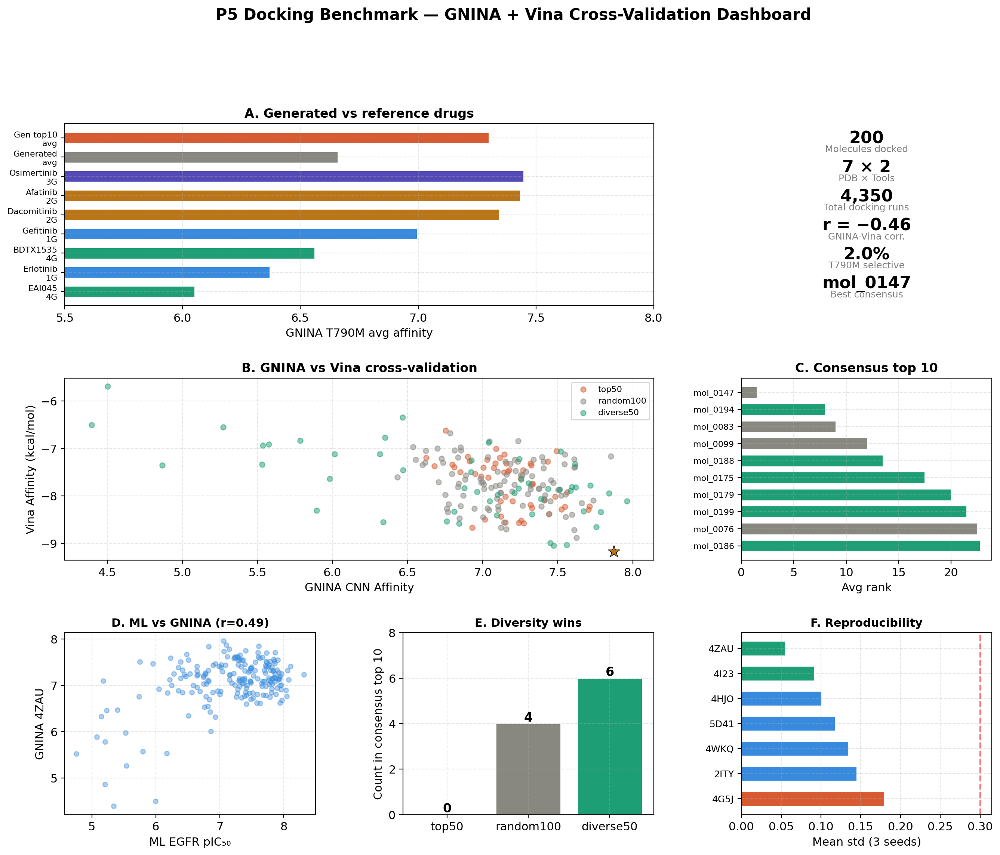
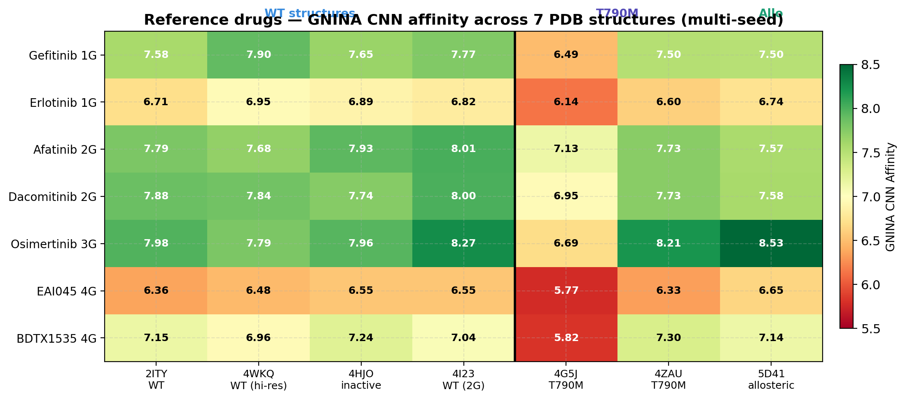
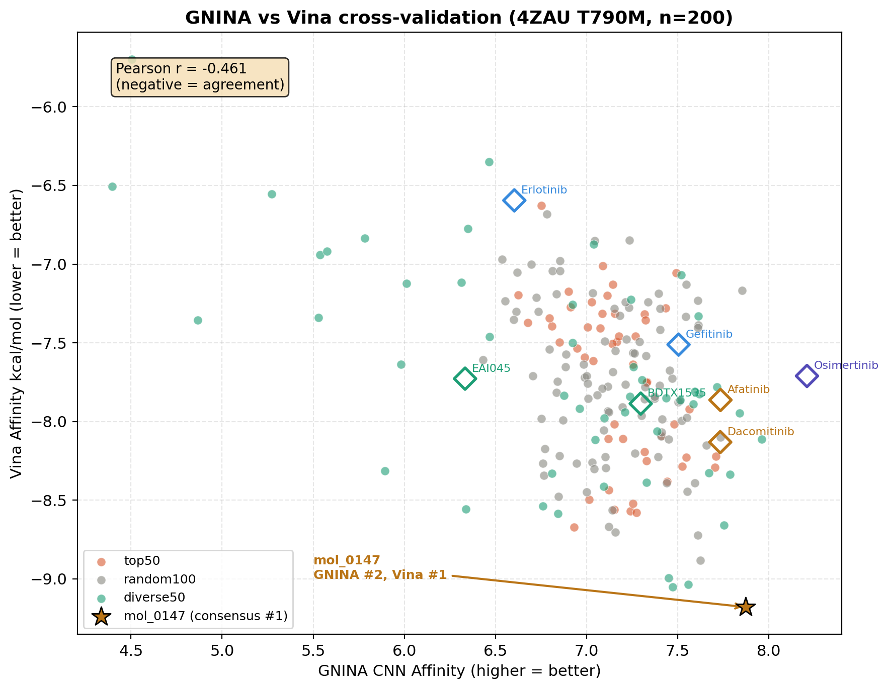
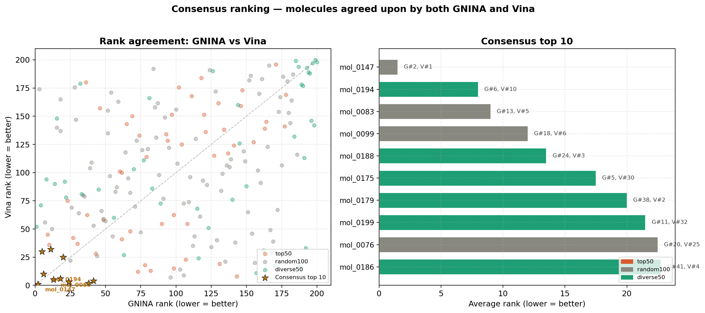
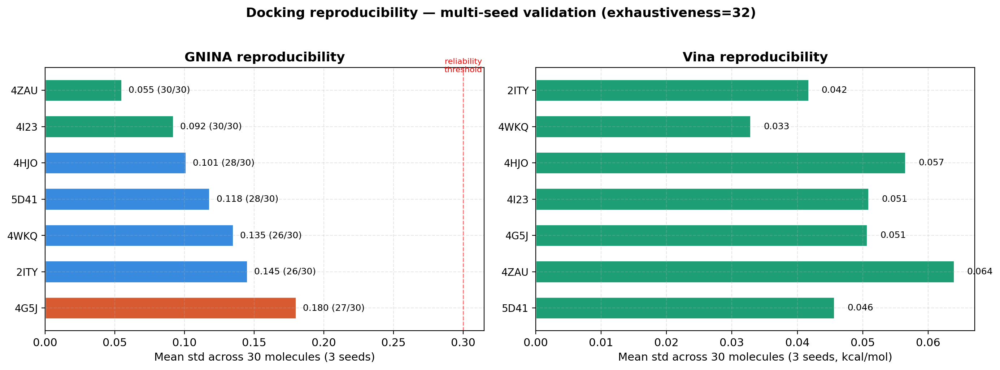
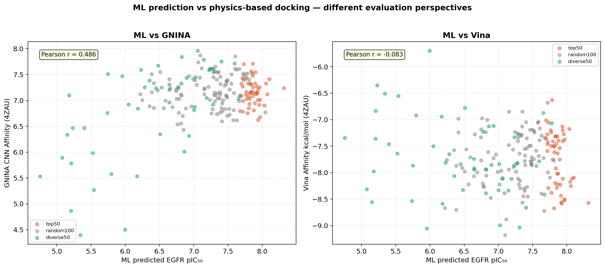

# P5. EGFR Docking Benchmark — Physics-Based Validation of Generated Molecules

## Overview

This project validates the computational drug discovery pipeline (P1→P2→P3) using molecular docking as an independent, physics-based evaluation layer. 200 generated molecules from the optimal DyRAMO configuration (P3) are docked against 7 EGFR crystal structures using two complementary docking tools — GNINA (CNN-based scoring) and AutoDock Vina (force-field-based scoring) — and benchmarked against 7 clinically approved/investigational EGFR inhibitors spanning four generations.

**Key question:** Do computationally generated molecules actually bind to the EGFR target, how do they compare to existing drugs, and can they be synthesized from commercially available reagents?



## Experimental design

### Docking targets — 7 PDB structures

| PDB | Target | Co-crystallized ligand | Role |
|-----|--------|----------------------|------|
| 2ITY | WT EGFR (active) | Gefitinib | WT reference |
| 4WKQ | WT EGFR (active) | Gefitinib (1.85 Å) | WT high-resolution |
| 4HJO | EGFR (inactive) | Erlotinib | Conformation selectivity |
| 4I23 | WT EGFR | Dacomitinib | 2G covalent reference |
| 4G5J | T790M mutant | Afatinib | T790M secondary |
| 4ZAU | T790M mutant | Osimertinib | T790M primary (key target) |
| 5D41 | T790M allosteric | EAI045 | Allosteric binding mode |

### Reference drugs — 1st to 4th generation

| Drug | Generation | Mechanism | Clinical status |
|------|-----------|-----------|----------------|
| Gefitinib | 1G | Reversible, ATP-competitive | Approved (2003) |
| Erlotinib | 1G | Reversible, ATP-competitive | Approved (2004) |
| Afatinib | 2G | Irreversible covalent (pan-ErbB) | Approved (2013) |
| Dacomitinib | 2G | Irreversible covalent (pan-ErbB) | Approved (2018) |
| Osimertinib | 3G | Irreversible covalent (T790M selective) | Approved (2015) |
| EAI045 | 4G | Allosteric (C797S bypass) | Preclinical |
| BDTX-1535 | 4G | Non-covalent (C797S bypass) | Phase I/II |

### Candidate molecules — stratified sampling (200)

From 3,530 reward-positive molecules generated by the optimal DyRAMO run (Step adaptive + AD ON + LightGBM):

| Group | Selection method | Count | Purpose |
|-------|-----------------|-------|---------|
| Top 50 | Highest ML reward | 50 | Best ML predictions |
| Random 100 | Random from remaining | 100 | Unbiased coverage |
| Diverse 50 | MaxMin Tanimoto picker | 50 | Structural diversity |

### Docking protocol

| Stage | Molecules | PDB structures | Exhaustiveness | Seeds | Tool |
|-------|-----------|---------------|---------------|-------|------|
| Reference drugs | 7 | 7 | 16 | 3 (0, 42, 123) | GNINA + Vina |
| 1st screening | 200 | 7 | 16 | 1 (0) | GNINA + Vina |
| 2nd refinement | Top 30 | 7 | 32 | 3 (0, 42, 123) | GNINA + Vina |

Total docking runs: ~4,350 (GNINA on GPU, Vina on CPU, run in parallel).

## Results

### 1. Reference drug docking — GNINA

| Drug | Gen | 4ZAU T790M | T790M avg | WT avg | Selectivity (T−W) |
|------|-----|-----------|-----------|--------|-------------------|
| Osimertinib | 3G | **8.21** | **7.45** | 8.00 | −0.55 |
| Afatinib | 2G | 7.73 | 7.43 | 7.86 | −0.42 |
| Dacomitinib | 2G | 7.73 | 7.34 | 7.87 | −0.52 |
| Gefitinib | 1G | 7.50 | 7.00 | 7.73 | −0.73 |
| BDTX-1535 | 4G | 7.30 | 6.56 | 7.10 | −0.54 |
| Erlotinib | 1G | 6.60 | 6.37 | 6.84 | −0.47 |
| EAI045 | 4G | 6.33 | 6.05 | 6.48 | −0.43 |

### 2. Reference drug docking — Vina (kcal/mol, more negative = stronger binding)

| Drug | Gen | 4ZAU T790M | T790M avg | WT avg | Selectivity (W−T) |
|------|-----|-----------|-----------|--------|-------------------|
| Dacomitinib | 2G | **−8.13** | **−7.66** | −8.68 | −1.02 |
| BDTX-1535 | 4G | −7.89 | −7.10 | −7.41 | −0.31 |
| Afatinib | 2G | −7.86 | −7.22 | −8.06 | −0.84 |
| EAI045 | 4G | −7.73 | −7.09 | −8.35 | −1.25 |
| Osimertinib | 3G | −7.71 | −6.63 | −7.88 | −1.25 |
| Gefitinib | 1G | −7.51 | −6.92 | −8.20 | −1.28 |
| Erlotinib | 1G | −6.59 | −6.26 | −7.22 | −0.97 |

**Observation:** GNINA and Vina rank the reference drugs differently — Osimertinib is #1 in GNINA but #5 in Vina. This reflects the fundamental difference between CNN-learned and physics-based scoring functions.



### 3. Generated molecules — 1st screening (200 molecules)

**GNINA:**
- T790M avg: 6.66 ± 0.50
- WT avg: 7.13 ± 0.45
- T790M selective (T−W > 0): 4/200 (2.0%)

**Vina:**
- T790M avg: −7.00 ± 0.47 kcal/mol
- WT avg: −8.29 ± 0.55 kcal/mol
- T790M selective: 0/200 (0.0%)

**vs reference drugs (GNINA T790M avg):**

| Comparison | Count | Percentage | Fair comparison? |
|-----------|-------|-----------|-----------------|
| > Erlotinib (1G, 6.37) | 166/200 | 83.0% | Yes (non-covalent) |
| > EAI045 (4G, 6.05) | 184/200 | 92.0% | Yes (non-covalent) |
| > BDTX-1535 (4G, 6.56) | 136/200 | 68.0% | Yes (non-covalent) |
| > Gefitinib (1G, 7.00) | 45/200 | 22.5% | Yes (non-covalent) |
| > Dacomitinib (2G, 7.34) | 3/200 | 1.5% | No (covalent drug) |
| > Osimertinib (3G, 7.45) | 0/200 | 0.0% | No (covalent drug) |

### 4. GNINA vs Vina cross-validation

**Per-PDB Pearson correlation (n=200):**

| PDB | Pearson r | Interpretation |
|-----|----------|---------------|
| 4HJO (inactive) | −0.479 | Moderate agreement |
| 4ZAU (T790M) | −0.461 | Moderate agreement |
| 4I23 (WT) | −0.422 | Moderate agreement |
| 2ITY (WT) | −0.407 | Moderate agreement |
| 4WKQ (WT) | −0.338 | Weak agreement |
| 4G5J (T790M) | −0.311 | Weak agreement |
| 5D41 (allosteric) | −0.266 | Weak agreement |

Note: negative r indicates agreement because GNINA (higher = better) and Vina (lower = better) use opposite scales.

**Rank divergence examples:**

| Molecule | GNINA rank | Vina rank | Interpretation |
|---------|-----------|----------|---------------|
| mol_0147 | #2 | #1 | Both agree — highest confidence |
| mol_0197 | #1 | #52 | GNINA-only — CNN bias possible |
| mol_0179 | #38 | #2 | Vina-only — force-field preference |



### 5. Consensus ranking — top 10

Molecules ranked highly by **both** docking tools (average of GNINA rank + Vina rank):

| Rank | Molecule | GNINA rank | Vina rank | Avg rank | EGFR (ML) | Group |
|------|---------|-----------|----------|---------|-----------|-------|
| 1 | **mol_0147** | 2 | 1 | **1.5** | 7.10 | random100 |
| 2 | mol_0194 | 6 | 10 | 8.0 | 7.40 | diverse50 |
| 3 | mol_0083 | 13 | 5 | 9.0 | 7.11 | random100 |
| 4 | mol_0099 | 18 | 6 | 12.0 | 7.67 | random100 |
| 5 | mol_0188 | 24 | 3 | 13.5 | 7.31 | diverse50 |
| 6 | mol_0175 | 5 | 30 | 17.5 | 7.14 | diverse50 |
| 7 | mol_0179 | 38 | 2 | 20.0 | 5.95 | diverse50 |
| 8 | mol_0199 | 11 | 32 | 21.5 | 6.48 | diverse50 |
| 9 | mol_0076 | 20 | 25 | 22.5 | 7.63 | random100 |
| 10 | mol_0186 | 41 | 4 | 22.8 | 7.02 | diverse50 |

**Sampling group representation in consensus top 10:**
- Top 50 (ML-best): **0/10** — none entered consensus top 10
- Random 100: **4/10**
- Diverse 50: **6/10** — structural diversity yields better docking candidates



### 6. Reproducibility — 2nd refinement (30 molecules × 3 seeds)

**GNINA (exhaustiveness=32, seeds=0/42/123):**

| PDB | Mean std | Reliable (std < 0.3) |
|-----|---------|---------------------|
| 4ZAU (T790M) | 0.055 | 30/30 (100%) |
| 4I23 (WT) | 0.092 | 30/30 (100%) |
| 4HJO (inactive) | 0.101 | 28/30 (93%) |
| 5D41 (allosteric) | 0.118 | 28/30 (93%) |
| 4WKQ (WT) | 0.135 | 26/30 (87%) |
| 2ITY (WT) | 0.145 | 26/30 (87%) |
| 4G5J (T790M) | 0.180 | 27/30 (90%) |

**Vina (exhaustiveness=32, seeds=0/42/123):**

All PDB structures show mean std < 0.07 kcal/mol — Vina results are highly reproducible.



### 7. ML prediction vs docking correlation

| Comparison | Pearson r | Interpretation |
|-----------|----------|---------------|
| EGFR (ML) vs GNINA 4ZAU | 0.486 | Moderate positive |
| EGFR (ML) vs Vina 4ZAU | −0.083 | No correlation |

ML prediction (LightGBM, 2D fingerprint-based) and physics-based docking (3D structure-based) evaluate different molecular properties. This divergence justifies multi-level validation.



### 8. Cross-PDB robustness

Same molecules docked to the same target (T790M) in different crystal structures:

| | 4ZAU (Osimertinib) | 4G5J (Afatinib) | Difference |
|--|-------------------|-----------------|-----------|
| Osimertinib | 8.21 | 6.69 | 1.52 |
| Gefitinib | 7.50 | 6.49 | 1.01 |
| Generated avg | — | — | 0.98 |

4ZAU consistently produces higher scores than 4G5J. This reflects **conformational bias** — the co-crystallized ligand shapes the binding pocket via induced fit, and our quinazoline-based molecules fit the Osimertinib-shaped pocket (4ZAU) better than the Afatinib-shaped pocket (4G5J).

### 9. Retrosynthesis analysis — synthetic feasibility (AiZynthFinder)

The consensus top 5 molecules were evaluated for synthetic feasibility using [AiZynthFinder](https://github.com/MolecularAI/aizynthfinder) with the USPTO-trained expansion policy and ZINC stock database.

| Rank | Molecule | Score | Steps | Materials | Solved? | GNINA (4ZAU) | Vina (4ZAU) |
|------|---------|-------|-------|-----------|---------|-------------|-------------|
| 1 | **mol_0175** | **0.994** | 2 | 3 | **Yes** | 7.73 | −8.26 |
| 2 | mol_0083 | 0.975 | 4 | 4 | **Yes** | 7.57 | −8.89 |
| 3 | mol_0194 | 0.956 | 6 | 5 | **Yes** | 7.75 | −8.66 |
| 4 | mol_0147 | 0.773 | 6 | 5 | No | 7.80 | −8.74 |
| 5 | mol_0188 | 0.738 | 4 | 4 | No | 7.55 | −9.01 |

**"Solved"** means AiZynthFinder decomposed the target molecule entirely into commercially available starting materials (ZINC database). Unsolved routes contain at least one intermediate requiring custom synthesis.

**Key synthesis routes:**

- **mol_0175** (score 0.994, 2 steps): SNAr coupling of 4-chloro-6,7-dimethoxyquinazoline with 3-aminobenzyl bromide, followed by O-alkylation with a triazole alcohol. All 3 starting materials are commercially available. Simplest route among all candidates.
- **mol_0083** (score 0.975, 4 steps): Suzuki coupling → SNAr → nitro reduction → N-alkylation with 4-hydroxypiperidine. Standard medicinal chemistry transformations, all 4 starting materials in ZINC stock.
- **mol_0194** (score 0.956, 6 steps): Suzuki coupling → ester hydrolysis → alkylation → SNAr → nitro reduction → Grignard addition. Longer route but fully solved with 5 commercially available reagents.
- **mol_0147** (score 0.773, unsolved): The consensus #1 by docking, but requires a fluoroalkyl-naphthyridine intermediate not available commercially. Custom synthesis of this intermediate would add multiple additional steps.
- **mol_0188** (score 0.738, unsolved): Contains an indazole-nitroaniline intermediate not in ZINC stock.

**Common scaffold:** All 5 molecules share the 4-chloro-6,7-dimethoxyquinazoline core — the same scaffold as Gefitinib and Erlotinib (1G EGFR inhibitors). This commercially available building block serves as the universal starting point for all synthesis routes.

**Binding affinity vs synthetic feasibility trade-off:** mol_0147 achieves the highest GNINA affinity (7.80) but the lowest synthesis score (0.773, unsolved). mol_0175 has slightly lower affinity (7.73) but near-perfect synthetic accessibility (0.994, 2 steps). This inverse relationship is typical in drug discovery — structural complexity that improves target binding often complicates synthesis.

**Practical recommendation:** mol_0175 (2-step, all materials in stock) as the primary lead compound, with mol_0083 (4-step, fully solved) as backup. mol_0147 could be pursued if the naphthyridine intermediate synthesis route is established separately.


## Pharmacological interpretation

### Why generated molecules do not exceed Osimertinib

Osimertinib (3G) forms a **covalent bond** with Cys797 via a Michael acceptor warhead. GNINA and Vina are **non-covalent docking tools** — they cannot model this covalent contribution. The docking score of 8.21 for Osimertinib reflects only the non-covalent portion; actual binding affinity is substantially higher.

Therefore, comparing non-covalent generated molecules to covalent drugs (2G, 3G) is not a fair comparison. The appropriate benchmarks are:
- **1G drugs** (Gefitinib, Erlotinib): reversible, non-covalent — **fair comparison**
- **4G drugs** (EAI045, BDTX-1535): non-covalent — **fair comparison**
- **2G/3G drugs** (Afatinib, Osimertinib): covalent — **not directly comparable**

Against fair comparisons, generated molecules perform well: 83% exceed Erlotinib, 68% exceed BDTX-1535, and 22.5% exceed Gefitinib in GNINA T790M affinity.

### Why selectivity is negative for all molecules — including approved drugs

All reference drugs show negative selectivity (T790M − WT < 0) in docking, yet Osimertinib is clinically approved as a T790M-selective drug. This is not a contradiction:

| Generation | Why selectivity is negative in docking | Clinical reality |
|-----------|---------------------------------------|-----------------|
| 1G | WT-selective drugs — negative is expected | Lose efficacy against T790M (consistent) |
| 2G/3G | Selectivity comes from covalent bond to C797, not modeled | Clinically selective via covalent mechanism |
| 4G | Selectivity via allosteric site or alternative binding mode | Orthosteric docking misses allosteric mechanism |

This result highlights a fundamental limitation of non-covalent orthosteric docking for evaluating mutant selectivity. Covalent docking tools (e.g., CovDock) or allosteric-specific protocols would be required for accurate selectivity assessment.

### GNINA vs Vina disagreement — a feature, not a bug

The moderate correlation (r = −0.46) between GNINA and Vina is expected and informative:
- GNINA uses a CNN trained on PDBbind crystal structures — it learns pose-level patterns from experimental data
- Vina uses a physics-based force field — it computes van der Waals, hydrogen bonds, and desolvation from first principles

When both tools agree on a molecule (e.g., mol_0147: GNINA #2, Vina #1), confidence is high because two independent methodologies converge. When they disagree (e.g., mol_0197: GNINA #1, Vina #52), the result may reflect tool-specific bias.

### Stratified sampling validated by docking

The consensus top 10 contains **zero molecules from the ML-top-50 group**, four from random sampling, and six from diversity sampling. This demonstrates that ML reward score is a poor predictor of docking performance — molecules that look good to LightGBM (2D pattern) do not necessarily fit the 3D binding pocket well.

**Implication for drug discovery pipelines:** Selecting candidates for physics-based validation solely by ML score introduces systematic bias. Structural diversity (MaxMin picking) recovers candidates that ML undervalues but physics-based methods recognize.

## Limitations

1. **Non-covalent docking only** — cannot evaluate covalent inhibitors or accurately compare with 2G/3G drugs
2. **Rigid receptor** — protein flexibility (induced fit) not modeled; partially addressed by using 7 PDB structures (ensemble docking)
3. **No solvent/entropy** — docking scores do not account for solvation free energy or entropic contributions
4. **No experimental validation** — docking scores are computational predictions, not measured binding affinities
5. **Orthosteric site only** — allosteric binding (relevant for 4G drugs like EAI045) not specifically evaluated
6. **CNN scoring bias (GNINA)** — trained on PDBbind, may favor poses similar to training data

## Future directions

1. **Covalent docking** (CovDock or AutoDock-GPU covalent mode) for fair comparison with 2G/3G inhibitors
2. **Flexible side-chain docking** (Vina --flex or GNINA flexible residues) for induced fit modeling
3. **MD simulation** for binding free energy estimation (MM-GBSA or FEP)
4. **Allosteric site docking** using 5D41 pocket specifically for 4G-type candidates
5. **Experimental validation** — SPR or enzyme assay for consensus top candidates

## Connection to full portfolio

This project completes the computational validation pipeline:

```
P1 (kMoL)         → ADMET prediction models (GNN architecture selection)
P2 (ChemTSv2)     → Molecular generation (reward design, MCTS policy optimization)
P3 (DyRAMO)       → Multi-objective optimization (AD ablation, reward hacking discovery)
P4 (kMoL→DyRAMO)  → Pipeline integration (reward signal collapse reproduction)
P5 (Docking)       → Physics-based validation (GNINA + Vina cross-validation)
P5 (Retrosynthesis)→ Synthetic feasibility (AiZynthFinder, USPTO + ZINC) ← this project
```

The Reward Design Spectrum discovered in P2–P4 (Signal Collapse ↔ Optimal ↔ Reward Hacking) is complemented by P5's finding that **ML prediction and physics-based validation evaluate different aspects of molecular quality**. A complete drug discovery pipeline requires both computational layers.

## Reproduction

### Environment
```bash
conda activate docking
# GNINA v1.3.2, AutoDock Vina v1.2.5, Open Babel 3.1.0, RDKit
```

### Candidate extraction
```bash
cd /home/nudge/Project/elix/docking
python3 extract_candidates.py  # Produces p5_200_candidates.csv (top50 + random100 + diverse50)
```

### GNINA docking (GPU)
```bash
nohup python scripts/dock_candidates.py \
    --candidates p5_200_candidates.csv \
    --top_n 200 \
    --exhaustiveness 16 \
    > docking_log.txt 2>&1 &
```

### Vina docking (CPU, can run in parallel with GNINA)
```bash
nohup python -u scripts/vina_validation.py \
    --candidates p5_200_candidates.csv \
    --top_n 200 \
    --exhaustiveness 16 \
    > vina_log.txt 2>&1 &
```

### Retrosynthesis (AiZynthFinder)
```bash
conda activate retro
cd /home/nudge/Project/elix/retrosynthesis
python scripts/run_retro.py          # Run AiZynthFinder on consensus top 5
python scripts/extract_routes.py     # Extract reaction steps and starting materials
python scripts/visualize_retro.py    # Generate p6_retrosynthesis_analysis.png
```

### Output files
| File | Description |
|------|------------|
| `reference_drugs_docking.csv` | GNINA results for 7 reference drugs × 7 PDB |
| `docking_results.csv` | GNINA 1st screening (200 molecules × 7 PDB) |
| `docking_results_refined.csv` | GNINA 2nd refinement (top 30 × 3 seeds × 7 PDB) |
| `reference_drugs_vina.csv` | Vina results for 7 reference drugs × 7 PDB |
| `vina_docking_results.csv` | Vina 1st screening (200 molecules × 7 PDB) |
| `vina_docking_refined.csv` | Vina 2nd refinement (top 30 × 3 seeds × 7 PDB) |
| `p6_retrosynthesis_analysis.png` | Retrosynthesis feasibility visualization |
